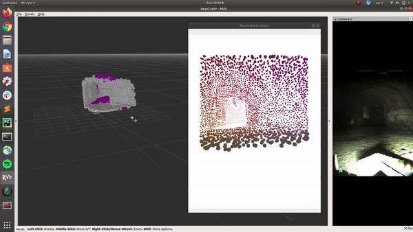

# Perception aware Trajectory Optimization

Perception aware trajectory optimization based on point cloud visibility estimation in a camera frustum.
The package is implemented as a ROS node.
For more information, please, have a look at the project:
[https://github.com/tpet/rpz_planning](https://github.com/tpet/rpz_planning).

[](https://youtu.be/0KzWxQjTqWM)

## Installation

Please, follow installation instructions in
[INSTALL.md](https://github.com/RuslanAgishev/trajectory_optimization/blob/master/INSTALL.md)

Before running the examples, download the
[data](https://drive.google.com/drive/folders/1sMELVBemqDqCp_4_0Nr6FzQkWbflS-Hl?usp=sharing)
and place it to the package root: `./data`

## Running

### Point cloud Visibility Estimation



Ones the package is installed, run the launch file and specify the bag file location:
```bash
roslaunch trajectory_optimization pointcloud_processor.launch
rosbag play PATH_TO_BAG_FILE -r 5 --clock
```
Replace `PATH_TO_BAG_FILE` with the path to the bag file, for example: `./data/josef_2019-06-06-13-58-12_proc_0.1m.bag`

In this example, the purple points are the whole cloud in a camera frame,
grey ones are only the visible points (not occluded by other points from the camera perspective).
The hidden points removal (HPR) algorithm implementation is based on the article
[Katz et al](http://www.weizmann.ac.il/math/ronen/sites/math.ronen/files/uploads/katz_tal_basri_-_direct_visibility_of_point_sets.pdf
).
The resultant point cloud rendering on an image plane is done with
[pytorch3d](https://github.com/facebookresearch/pytorch3d) library.

### [Multiple cameras](https://drive.google.com/file/d/1PFs8tzX9B3NjMi_c10OxPncgxdCq6Dm_/view?usp=sharing)

In this example, the point cloud visibility is estimated for each individual camera
(in its field of view and the distance range) separately.
The combined point cloud is then visualized in the robot `base_link` frame.

### Position Optimization


Ego-pose optimization based on the observed in camera frustum point cloud visibility estimation.
In this example, the points color encodes a distance-based (to camera frame) reward.
The white points are currently observed ones by camera.

```bash
roslaunch trajectory_optimization pose_optimization.launch
```

### Waypoints Optimization


Camera pose (X, Y and Yaw) optimization is consequently applied here for each separate sampled way-point
of an initial trajectory.

### Trajectory Evaluation


A camera trajectory could be evaluated by a number of observed voxels (points in the cloud).
Single pose visibility estimation rewards are combined using log odds representation as it
is done in [OctoMap](https://www.researchgate.net/publication/235008236_OctoMap_A_Probabilistic_Flexible_and_Compact_3D_Map_Representation_for_Robotic_Systems) paper.

### Trajectory Optimization


Based on the evaluation result, the trajectory (consisting of several waypoints)
is optimized with the goal to increase overal visibility score.

```bash
roslaunch trajectory_optimization trajectory_optimization.launch
```

## Reference

**Trajectory Optimization using Learned Robot-Terrain Interaction Model in Exploration of Large Subterranean Environments** [PDF](https://ieeexplore.ieee.org/document/9699042), [Video](https://youtu.be/0KzWxQjTqWM), [Code](https://github.com/tpet/rpz_planning/tree/icra-2022).
